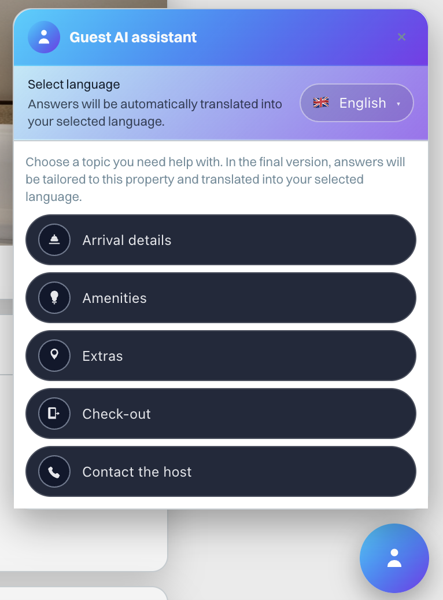

# Guest AI Assistant & House Rules — 2025-12-02

Acest document rezumă modificările pentru:

- **Guest AI assistant** (chat‑bot fix, în colțul dreapta‑jos, pe pagina publică `r/[token]`).
- **Check‑in Editor** — zona de pregătire House Rules pentru AI (PDF → text curat).

Documentul poate fi folosit ca articol de changelog / release note și ca referință tehnică internă.

---

## 1) Migrație DB

Fișier nou:

- `supabase/migrations/2025-12-02_guest_ai_assistant.sql`
  - `properties.ai_house_rules_text text null`
    - Text “curățat” pe care îl folosim ca **context pentru Guest AI assistant** (reguli, instrucțiuni de sosire, facilități etc.).
    - Este complet separat de PDF‑ul original — hostul poate șterge / simplifica / anonimiză înainte de a salva.
  - `properties.check_out_time text null`
    - Asigurăm existența coloanei (unele instanțe o aveau deja creată manual).
    - Folosită ca default pentru ora de check‑out în e‑mailuri, cron și în răspunsurile AI pentru check‑out.

Migrația este idempotentă (`if not exists`), deci poate rula în siguranță și pe instanțe unde coloanele există deja.

---

## 2) Check‑in Editor — House Rules pentru AI

Fișiere cheie:

- `app/app/checkinEditor/ui/CheckinEditorClient.tsx`
- API:
  - `app/api/property/regulation/upload/route.ts` (existent)
  - `app/api/property/regulation/read-text/route.ts`
  - `app/api/property/ai-context/route.ts`

### 2.1 Buton nou — *Read & prepare text for AI*

În secțiunea **House Rules PDF** din Check‑in Editor:

- Dacă există un PDF încărcat (`properties.regulation_pdf_url`), apare butonul:
  - `Read & prepare text for AI` (gradient mov/albastru, “AI vibe”).
- Flux:
  1. Host apasă butonul → se deschide modalul “Use House Rules for guest assistant”.
  2. Peste el apare un pop‑up de stare:
     - `Reading the file…` (loading state).
     - La succes: mesaj scurt că textul a fost pregătit pentru Guest AI assistant + buton **Check & edit**.
     - La eșec de extragere: mesaj clar că nu s‑a putut extrage textul și buton **Fill manually**.
  3. În cardul principal hostul vede textarea cu textul pentru AI:
     - Poate edita / șterge orice date sensibile (coduri, parole, linkuri private).
     - Poate salva via **Use for AI** → POST `/api/property/ai-context`.

### 2.2 Endpoint — `/api/property/regulation/read-text`

- Primește `propertyId`, încarcă PDF‑ul din bucketul `property-docs` (via `regulation_pdf_url`).
- Încearcă o extragere best‑effort a textului:
  - Normalizare de `TextDecoder` + heuristici simple pentru spații și line breaks.
  - Nu folosește AI; este pur text extraction.
- Răspuns:
  - `{ text: "..." }` la succes.
  - `{ error: "..." }` la eșec (UI îl tratează prin mesajul “We couldn't automatically extract…” și opțiunea de completare manuală).

### 2.3 Endpoint — `/api/property/ai-context`

- `POST { propertyId, houseRulesText }`
- Scrie în `properties.ai_house_rules_text`.
- Folosit exclusiv ca **context static** pentru toate întrebările AI (sosire, facilități, extra, check‑out).

---

## 3) Guest AI Assistant — pagina publică `r/[token]`

Fișiere cheie:

- UI:
  - `app/r/[token]/MessagesView.tsx` (componenta `ChatFab`)
  - `app/r/[token]/LanguageViewer.tsx` (pentru mesaje HTML obișnuite)
- API:
  - `app/api/guest-assistant/menus/route.ts`
  - `app/api/guest-assistant/arrival/route.ts`
  - `app/api/guest-assistant/amenities/route.ts`
  - `app/api/guest-assistant/extras/route.ts`
  - `app/api/guest-assistant/checkout/route.ts`
  - `app/api/reservation-message/public/[token]/route.ts` (extins pentru AI context)

### 3.1 UI — Floating assistant + hint

- Buton tip FAB rotund, fix în colțul dreapta‑jos:
  - Gradient puternic: `linear-gradient(135deg, #00d1ff, #7c3aed)`.
  - Avatar simplu (silhuetă persoană) în cerc cu gradient.
- Hint deasupra:
  - EN: `Have a question? Guest AI assistant can help.`
  - RO: `Ai o întrebare? Guest AI assistant te poate ajuta.`
  - Dispare automat după 5 secunde sau la click.

### 3.2 Limbă — selector cu steaguri

- Invitația e mereu în EN:
  - “Select language”
  - “Answers will be automatically translated into your selected language.”
- Dropdown cu steaguri (RO, EN, DE, FR, ES, IT, PT, NL, PL, HU, CS, SK).
- Toate etichetele de butoane se traduc prin GPT:
  - Endpoint: `/api/guest-assistant/menus`
  - Model: `gpt-4.1-mini`
  - Returnează un JSON cu chei fixe (`arrival`, `amenities`, `extras`, `checkout`, `back`, etc.).

### 3.3 Meniu principal — 4 topice

După ce a ales limba, oaspetele vede 4 butoane principale (stil pill, gradient dark, icon personalizat):

- **Arrival details** (icon clopoțel recepție)
- **Amenities** (icon bec)
- **Extras** (icon pin locație)
- **Check-out** (icon ușă + săgeată)
- **Contact the host** (telefon)

Toate textele sunt traduse în limba aleasă.

---

## 4) Arrival — parcarea, coduri de acces, ora de sosire

### 4.1 Sub‑meniuri Arrival

La click pe **Arrival details**:

- Sub‑meniuri:
  - `Parking information`
  - `Access codes`
  - `Arrival time`
- Toate etichetele provin din `/api/guest-assistant/menus`.

### 4.2 Endpoint — `/api/guest-assistant/arrival`

`POST` cu:

- `language` — numele limbii în EN (ex. „Romanian”, „German”).
- `topic` — `"parking"` / `"access_codes"` / `"arrival_time"`.
- `details` — property & guest info (nume proprietate, nume oaspete, date rezervare).
- `property` — include și:
  - `ai_house_rules_text`
  - `regulation_pdf_url` (doar ca metadată; AI nu citește PDF‑ul direct).
- `messages[]` — toate mesajele vizibile (RO/EN) convertite în plain text.

Promptul AI:

- Caută **întâi în mesaje**, apoi în `ai_house_rules_text`.
- Nu are voie să inventeze:
  - coduri de acces,
  - numere de telefon,
  - adrese,
  - locații de parcare,
  - ore.
- Dacă nu e 100% sigur → `status: "missing"` și mesaj (RO/EN) de tip:
  - “Nu este clar din informațiile disponibile. Te rugăm să contactezi gazda…”
- Răspunsul este mereu JSON minificat:
  - `{"status":"found"|"missing","answer":"..."}`.

`arrival_time` nu folosește AI pentru valoare — citește direct ora de check‑in (`details.check_in_time`) și doar o prezintă frumos în limba selectată.

---

## 5) Amenities — Wi‑Fi, fier de călcat, minibar, etc.

### 5.1 Sub‑meniuri Amenities

La click pe **Amenities** apar:

- Wi‑Fi (network & password)
- Iron / ironing
- Minibar
- Coffee machine
- Air conditioning / climate control
- Washing machine
- Dishwasher
- House Rules (full document) — deschide PDF‑ul, **fără AI**.

### 5.2 Endpoint — `/api/guest-assistant/amenities`

`POST` cu:

- `topic` ∈ `["wifi","iron","minibar","coffee_machine","ac","washing_machine","dishwasher"]`
- Restul câmpurilor similare `/arrival`.

Prompt:

- Nu inventează echipamente care nu există în text.
- Pentru Wi‑Fi:
  - Dă SSID/parolă **doar** dacă sunt scrise clar.
  - Niciodată nu generează alt nume sau altă parolă.
- Când găsește informația:
  - Răspuns scurt (1–3 fraze) în limba selectată.
- Dacă nu găsește nimic clar:
  - `status: "missing"` și text de tip:
    - “Nu este clar… Te rugăm să contactezi gazda…”
- UI adaugă automat un buton “If you still have questions, contact the host” (tradus).

---

## 6) Extras — unde mănânci / ce vizitezi

### 6.1 Sub‑meniuri Extras

La click pe **Extras**:

- `Where to eat or have a coffee`
- `What to visit nearby`

### 6.2 Endpoint — `/api/guest-assistant/extras`

`POST` cu:

- `topic` — `"eat_drink"` / `"visit"`.
- Mesaje + `ai_house_rules_text` ca surse.

Prompt:

- Poate menționa **doar** locuri / recomandări explicit scrise.
- Nu inventează restaurante, cafenele sau obiective noi.
- Dacă nu există recomandări:
  - `status: "missing"` + text de tip:
    - “Nu există informații clare… Te rugăm să soliciți detalii de la gazdă.”

UI arată răspunsul + buton de contact gazdă + Back.

---

## 7) Check‑out — sumar și recomandare pentru late check‑out

### 7.1 Endpoint — `/api/guest-assistant/checkout`

`POST` cu:

- `details` — include `end_date` + `check_out_time` (din booking sau din proprietate).
- `property` — include `ai_house_rules_text`, `check_out_time`.
- `messages` — pentru eventuale instrucțiuni de “stins lumini, încuiat uși, lăsat chei, gunoi, vase etc.”.

Prompt:

- Spune **clar**:
  - data de check‑out (din `end_date`),
  - ora de check‑out (din `check_out_time`, fără modificări).
- Dacă ora lipsește:
  - menționează explicit că ora nu e configurată și cere o confirmare de la gazdă.
- Adaugă un rezumat scurt al instrucțiunilor de check‑out (dacă există în mesaje / house rules).
- Nu inventează reguli sau ore.
- Fallback: mesaj generic “Please contact the host for precise details”.

UI:

- Afișează card cu răspunsul scurt.
- Buton tradus:
  - “For late check-out or other details, contact the host” (`checkout_cta` tradus de GPT).
- Buton Back întoarce la meniul principal.

---

## 8) Comportament de siguranță (anti‑hallucination)

În toate endpoint‑urile AI:

- Reguli comune în prompt:
  - Folosesc **doar**:
    - detalii rezervare,
    - mesaje (plain text),
    - `ai_house_rules_text`.
  - Nu citesc PDF‑ul direct (hostul decide ce text ajunge în AI).
  - Nu inventează coduri, parole, numere, adrese, ore.
  - Dacă nu sunt 100% sigure → `status: "missing"` și recomandare explicită către gazdă.
- Toate răspunsurile sunt JSON strict:
  - ușor de consumat în UI, fără parsing fragil.

---

## 9) Rezumat pentru changelog (scurt, marketing)

Poți folosi paragraful de mai jos în changelog public / newsletter:

> **Guest AI assistant pentru oaspeți (beta)**  
> Am introdus un asistent AI fix pe pagina publică a rezervării (`r/[token]`), care poate răspunde la întrebări despre sosire, parcare, coduri de acces, facilități, check‑out și recomandări de zonă — în limba aleasă de oaspete. Răspunsurile se bazează strict pe mesajele și regulile casei configurate de tine, fără să inventeze coduri sau informații sensibile.  
> În Check‑in Editor poți încărca PDF‑ul cu House Rules, îl poți converti rapid în text pentru AI, îl editezi și îl salvezi ca sursă sigură de informații pentru oaspeți.

